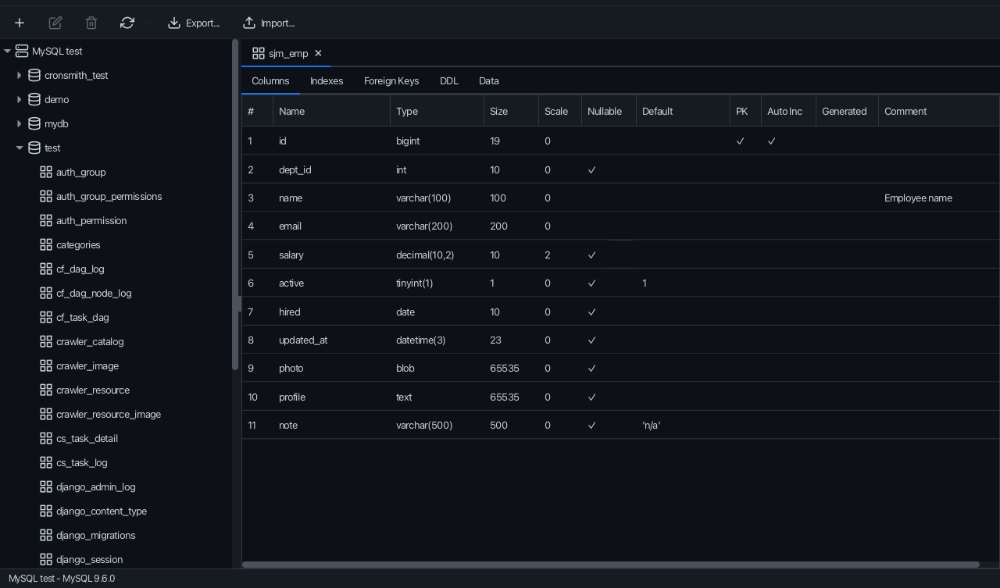
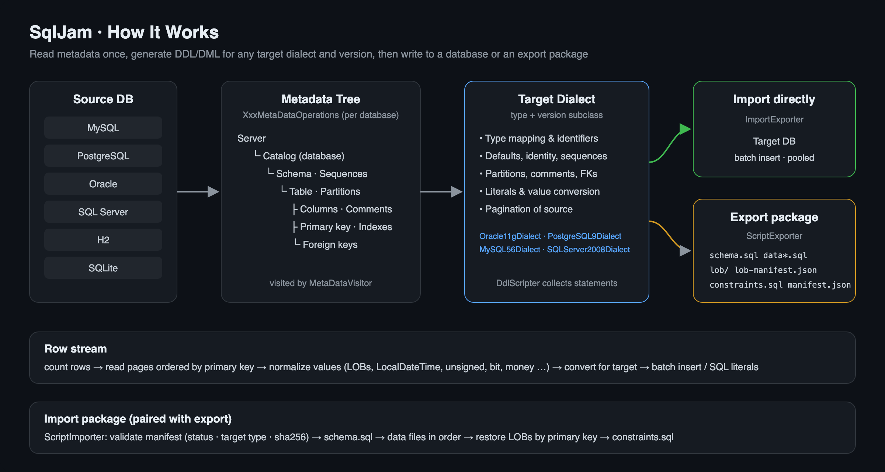
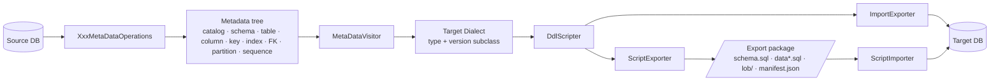
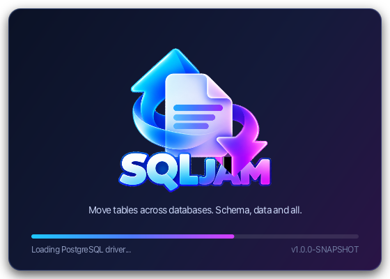
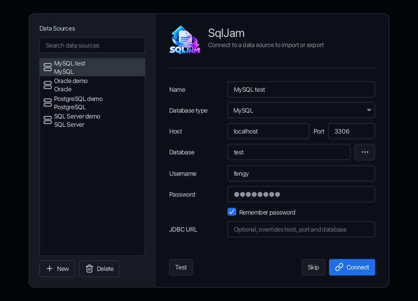
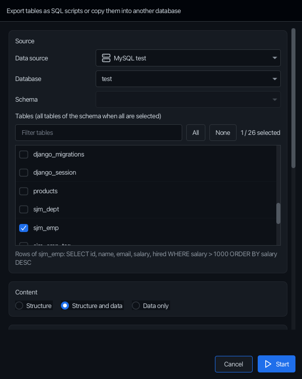
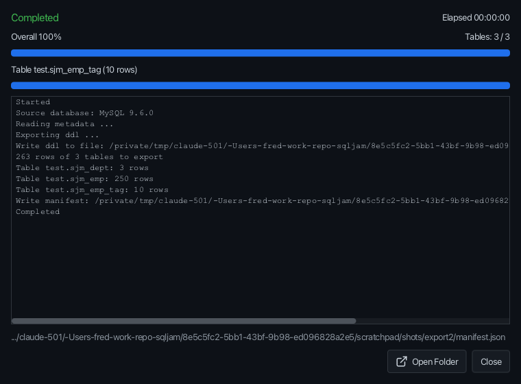
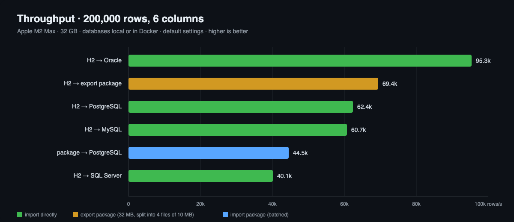

<div align="center">

# SqlJam

**Move tables across databases. Schema, data and all.**

SqlJam is a desktop import/export tool for MySQL, PostgreSQL, Oracle, SQL Server, H2, SQLite and more.
It copies tables (with indexes, constraints, sequences and partitions) **directly into another database**, or saves them as a **self-describing SQL export package** that can be imported later.




</div>

---

## Features

| Problem | How SqlJam solves it |
|---|---|
| Different SQL dialects break hand-written migrations | One metadata model, **a dialect per target**: types, identifiers, defaults, identity and literals are translated |
| "Works on my 16, fails on their 9.4" | **Version-aware dialects** (`Oracle11gDialect`, `PostgreSQL9Dialect`, `MySQL56Dialect`, `SQLServer2008Dialect` …) chosen by detected or selected version |
| Tables arrive without keys, indexes or sequences | Copies **primary keys, unique/regular indexes, foreign keys, comments, sequences, identity values and partitions** |
| Huge `data.sql` files nobody can open | **Split data files** by size (default 10 MB): `orders.sql`, `orders_2.sql` …, one file per table or a single `data.sql` |
| BLOB/CLOB literals explode scripts and hit 4000-byte limits | **LOBs are stored as files** (`lob/<table>/000001_<column>.blob`) and restored by primary key |
| Scripts lose context ("which DB? which version? complete?") | **`manifest.json`** records source, target, options, files (with SHA-256) and row counts, export and import are paired |
| Timestamps shift, unsigned values overflow, `bit` becomes garbage | Portable value pipeline: `LocalDateTime`, unsigned widening, bit strings, money, UUID, JSON, XML, arrays |
| Re-runs fail half way | Idempotent DDL (drop/create, `IF NOT EXISTS`, sequence restart), FKs created after data |
| Long jobs are a black box | **Percentage progress**, per-table progress, error log and cancel in the UI |

---

## How It Works





| Component | Role |
|---|---|
| `Exporter` | Reads metadata, counts rows, pages rows (ordered by primary key) and feeds an `ExportHandler` |
| `ScriptExporter` / `ImportExporter` | Facades: export to a package / import into a database |
| `ScriptImporter` | Imports an export package (validates `manifest.json`, runs files in order, restores LOBs) |
| `Dialect` + `impexp.db.*` | Per-database SQL generation. Old versions are subclasses |
| `MetaDataOperations` + `impexp.db.*` | Per-database metadata fixes (comments, identity, generated columns, partitions, sequences) |
| `face.*` | JavaFX UI (AtlantaFX themes, Ikonli icons) |

---

## Requirements

Only **Java 17+** is needed to run SqlJam. JavaFX and all JDBC drivers are inside the runnable jar. Building from source needs no Maven installation either, the Maven Wrapper (`./mvnw`) is included.

| Platform | Runnable jar | Launcher | Supported |
|---|---|---|:---:|
| Windows 10 / 11 (x64) | `sqljam-<version>-win.jar` | `sqljam.bat` | ✅ |
| macOS Apple Silicon | `sqljam-<version>-mac-aarch64.jar` | `sqljam.sh` | ✅ |
| macOS Intel | `sqljam-<version>-mac.jar` | `sqljam.sh` | ✅ |
| Linux x64 (GTK 3) | `sqljam-<version>-linux.jar` | `sqljam.sh` | ✅ |

| Database | Tested on | Supported from |
|---|---|---|
| MySQL | 9.6 | 5.5 (`MySQL55/56/57Dialect`) |
| PostgreSQL | 16 | 9.x (`PostgreSQL9/10Dialect`) |
| Oracle | 23ai Free | 11g (`Oracle11g/12cDialect`) |
| SQL Server | 2022 | 2008 (`SQLServer2008Dialect`) |
| H2 | 2.3 | 2.x |
| SQLite | 3.46 | 3.x |

All JDBC drivers are bundled, no extra downloads.

---

## Quick Start

```bash
git clone git@github.com:paganini2008/sqljam.git
cd sqljam
./mvnw -DskipTests package       # Windows: mvnw.cmd -DskipTests package, output goes to bin/
bin/sqljam.sh                    # Windows: bin\sqljam.bat, or double click the jar of your platform
```

```text
bin/
├── sqljam-1.0.0-SNAPSHOT-win.jar           # runnable jar of each platform,
├── sqljam-1.0.0-SNAPSHOT-mac-aarch64.jar   # JavaFX and all JDBC drivers inside
├── sqljam-1.0.0-SNAPSHOT-mac.jar
├── sqljam-1.0.0-SNAPSHOT-linux.jar
├── sqljam.sh / sqljam.bat                  # launchers, pick the jar of the platform
├── sqljam.properties                       # configuration, edit and restart
├── sqljam.vmoptions                        # JVM options, one per line
├── sqljam.png                              # Dock icon of macOS
├── sqljam-1.0.0-SNAPSHOT-sources.jar
└── sqljam-1.0.0-SNAPSHOT-javadoc.jar
```

Keep `sqljam.properties` and `sqljam.vmoptions` next to the runnable jar. Copy the folder anywhere and SqlJam still finds them, even when started by double click.

SqlJam starts with a splash screen while it loads the configuration, the data sources and the JDBC drivers:

<p align="center"></p>

1. Create a **data source** on the login page and click **Connect**.
2. Right-click a database or schema → **Export…**
3. Pick tables, choose **SQL scripts** (folder) or **Database** (another data source), press **Start**.

| Login | Export wizard | Progress |
|---|---|---|
|  |  |  |

Expected export package:

```text
export/
├── schema.sql            # tables, sequences, indexes, comments
├── data.sql              # rows (data_2.sql, data_3.sql … when > 10 MB)
├── lob/
│   └── document/
│       ├── 000001_content.clob
│       └── 000001_attachment.blob
├── lob-manifest.json     # LOB files → table / primary key / column
├── constraints.sql       # foreign keys, applied after data
└── manifest.json         # source, target, options, files (sha256), row counts
```

---

## Examples

### 1. Export tables as an export package

**Input**: MySQL database `shop`, target dialect PostgreSQL 16, one file per table.

```java
ScriptExporter exporter = new ScriptExporter(new File("export"), DataFileStrategy.FILE_PER_TABLE,
        10 * 1024 * 1024);
Exporter.ExportConfiguration config = exporter.getConfiguration();
config.setDbType(DbType.MYSQL);
config.setUrl(DbType.MYSQL.getUrl("localhost", 3306, "shop"));
config.setUsername("root");
config.setPassword("secret");
config.setIncludedCatalogNames(new String[]{"shop"});
config.setIdReused(true);                      // keep identity values
exporter.setTargetDbType(DbType.POSTGRESQL);   // generate PostgreSQL sql
exporter.setTargetSchemaName("public");
exporter.exportDdlAndData();
```

**Output**: `export/schema.sql`, `export/data/orders.sql`, `export/data/orders_2.sql`, `export/lob/…`, `export/manifest.json`:

```sql
CREATE TABLE IF NOT EXISTS public.orders
(
    id                            bigserial                      NOT NULL,
    total                         numeric(12, 2)                 DEFAULT 0.00,
    paid                          boolean                        DEFAULT true,
    CONSTRAINT orders_pkey PRIMARY KEY (id)
);
```

### 2. Copy tables into another database

**Input**: Oracle 11g schema `HR` → SQL Server `demo.hr` (created if missing).

```java
ImportExporter importer = new ImportExporter();
Exporter.ExportConfiguration source = importer.getExportConfiguration();
source.setDbType(DbType.ORACLE);
source.setUrl(DbType.ORACLE.getUrl("ora-host", 1521, "ORCL"));
source.setUsername("hr");
source.setPassword("secret");
source.setIncludedSchemaNames(new String[]{"HR"});
source.setIdReused(true);

ImportExportHandler.ImportConfiguration target = importer.getImportConfiguration();
target.setDbType(DbType.SQLSERVER);
target.setUrl(DbType.SQLSERVER.getUrl("mssql-host", 1433, "demo"));
target.setUsername("sa");
target.setPassword("secret");
target.setTargetSchemaName("hr");            // created automatically
importer.setExportListener(new ExportListener() {
    @Override
    public void onProgress(long processed, long total) {
        System.out.printf("%d%%%n", processed * 100 / Math.max(total, 1));
    }
});
importer.exportDdlAndData();
```

**Output**: `0% … 100%`. Tables, keys, indexes, comments and sequences in `demo.hr`. Identity columns continue from the imported max value.

### 3. Import an export package

```java
try (Connection connection = DriverManager.getConnection(
        "jdbc:postgresql://localhost:5432/demo", "postgres", "secret")) {
    ScriptImporter importer = new ScriptImporter(connection, DbType.POSTGRESQL);
    importer.importDirectory(new File("export"));
    System.out.println(importer.getExecutedCount() + " statements, " + importer.getLobCount() + " LOBs");
}
```

**Output**: `ScriptImporter` refuses packages whose status is not `COMPLETED`, whose target type differs, or whose files fail the SHA-256 check.

### 4. Type translation (cross-database)

| Source column | → PostgreSQL | → Oracle | → SQL Server | → MySQL |
|---|---|---|---|---|
| MySQL `bigint unsigned` | `numeric(20, 0)` | `NUMBER(20,0)` | `decimal(20,0)` | same |
| MySQL `tinyint(1)` | `boolean` | `NUMBER(1)` | `bit` | same |
| PostgreSQL `jsonb` | same | `CLOB` | `nvarchar(max)` | `json` |
| PostgreSQL `uuid` | same | `VARCHAR2(36)` | `uniqueidentifier` | `char(36)` |
| Oracle `NUMBER(9)` / `NUMBER(19)` | `int4` / `int8` | same | `int` / `bigint` | `int` / `bigint` |
| SQL Server `datetime2(7)` | `timestamp` (µs) | `TIMESTAMP(7)` | same | `datetime(6)` |
| SQL Server `tinyint` (0 to 255) | `int2` | `NUMBER(5)` | same | `smallint` |

### Best practices

| Do | Why |
|---|---|
| Keep **Keep identity values** on | Foreign keys stay valid. Identities/sequences are reset to `max + 1` |
| Pick the **target version** when exporting for an older server | e.g. `11.2` generates sequences + triggers instead of identity columns |
| Use **one file per table** for large exports | Re-run or inspect a single table easily |
| Import packages with SqlJam | Manifest validation, ordered files, LOB restore and FKs last |

---

## Configuration

All settings live in `sqljam.properties`, placed next to the runnable jar in `bin/`.

| Layer (later wins) | Location |
|---|---|
| Built-in defaults | Coded in the application |
| Application file | `sqljam.properties` or `conf/sqljam.properties` next to the jar, or `-Dsqljam.app.config=/path` |
| User settings saved by the UI | `~/.sqljam/sqljam.properties`, or `-Dsqljam.config=/path` |

| Property | Default | Description |
|---|---|---|
| `sqljam.home` | `${user.home}/.sqljam` | Application data directory |
| `sqljam.connections.file` | `${sqljam.home}/connections.json` | Saved data sources |
| `sqljam.ui.theme` | `Primer Dark` | Primer/Nord/Cupertino Light & Dark, Dracula |
| `sqljam.ui.window.width` / `height` | `1280` / `800` | Main window size |
| `sqljam.banner.mode` | `console` | Startup banner with the version: `console`, `log` or `off` |
| `sqljam.banner.location` | | Custom banner file, `${sqljam.version}` and `${java.version}` are resolved |
| `sqljam.splash.enabled` | `true` | Splash screen with the logo while starting |
| `sqljam.splash.min-duration` | `1200` | Minimum time of the splash screen in ms, so that it does not flash |
| `sqljam.ui.data.page-size` | `200` | Rows per page in the data viewer |
| `sqljam.export.page-size` | `5000` | Rows read per page when exporting, tuned by benchmark |
| `sqljam.export.lob-page-size` | `100` | Rows per page for tables with LOB columns, keeps memory low |
| `sqljam.import.batch-size` | `1000` | INSERT statements per batch when importing a package (Oracle uses PL/SQL blocks) |
| `sqljam.export.max-file-size` | `10485760` | Max bytes of a data file (0 = unlimited) |
| `sqljam.export.data-file-strategy` | `SINGLE_FILE` | `SINGLE_FILE` or `FILE_PER_TABLE` |
| `sqljam.export.lob-separated` | `true` | Write LOBs as files |
| `sqljam.pool.maximum-size` | `10` | HikariCP max pool size |
| `sqljam.pool.minimum-idle` | `1` | HikariCP min idle connections |
| `sqljam.pool.connection-timeout` | `30000` | ms |
| `sqljam.pool.idle-timeout` | `300000` | ms |
| `sqljam.pool.max-lifetime` | `1800000` | ms |

JVM options live in `sqljam.vmoptions` next to the runnable jar, one option per line. The launchers pass them to Java, and a jar started by double click restarts itself with them. `JAVA_OPTS` adds more and wins.

```text
# sqljam.vmoptions (defaults)
-Xms256m
-Xmx2g
-XX:+UseG1GC
-Dfile.encoding=UTF-8
```

Export options (UI / `ExportConfiguration`):

| Option | Default | Description |
|---|---|---|
| `tableRecreated` | `true` | Drop and recreate target tables |
| `idReused` | `false` (UI: `true`) | Copy identity values and reset sequences |
| `indexIncluded` / `foreignKeyIncluded` / `commentIncluded` / `sequenceIncluded` | `true` | Objects to copy |
| `failFast` | `true` | Stop on the first data error |
| `identifierCase` | `AUTO` | `AUTO`, `KEEP`, `LOWER`, `UPPER` |

---

## Performance



| Scenario (200,000 rows × 6 columns) | Time | Rows/s |
|---|---|---|
| H2 → Oracle 23ai | 2.1 s | 95.3k |
| H2 → export package (PostgreSQL, 32 MB, 4 files) | 2.9 s | 69.4k |
| H2 → PostgreSQL 16 | 3.2 s | 62.4k |
| H2 → MySQL 9.6 | 3.3 s | 60.7k |
| H2 → SQL Server 2022 | 5.0 s | 40.1k |
| Export package → PostgreSQL | 4.5 s | 44.5k |

Environment: Apple M2 Max, 32 GB, JDK 17. MySQL/PostgreSQL local, Oracle/SQL Server in Docker. Default settings.

| Design choice | Benefit |
|---|---|
| Rows paged by primary key | Stable, deterministic reads on every database |
| Tables copied one by one | Predictable load on production servers |
| Packages contain plain SQL | Readable, editable and portable. Direct import uses batched inserts for maximum speed |

---

## Documentation

| Topic | Link |
|---|---|
| Project site | [paganini2008.github.io/sqljam](https://paganini2008.github.io/sqljam/) |
| Blog (English / 中文 / Medium) | [docs/blogger](docs/blogger) |
| Change logs | [change_logs](change_logs) |
| Core API | `com.github.sqljam.impexp` (`Exporter`, `ScriptExporter`, `ImportExporter`, `ScriptImporter`) |

**FAQ**

| Question | Answer |
|---|---|
| Can I export only the structure? | Yes. Rows are optional. Pick content **Structure** (`ExportMode.DDL`) for a package or a direct import. Tables, keys, indexes, comments, sequences and partitions are created without rows |
| Can I generate scripts for an older server? | Yes, choose the target version (e.g. Oracle `11.2`, SQL Server `2008`) and a compatible dialect is used |
| Can I keep the password out of disk? | Uncheck *Remember password* on the login page, it stays in memory for the session |
| How do I run the tests? | `mvn verify`, integration tests use local databases and are skipped when unreachable |

---

## Contributing & License

| Step | |
|---|---|
| Issues | [github.com/paganini2008/sqljam/issues](https://github.com/paganini2008/sqljam/issues) |
| Pull requests | Fork → branch → `mvn verify` (≥ 80% coverage gate) → PR |
| Code style | Match existing code: `getXxxStatement` naming, Apache license header, class header javadoc, 4-space indent, no Spring |
| New database or version | Add `XxxDialect` / `XxxMetaDataOperations` in `impexp.db`, register in `DbType`, add a fixture in `src/test/resources/<db>/` |

License: [Apache License 2.0](LICENSE).
