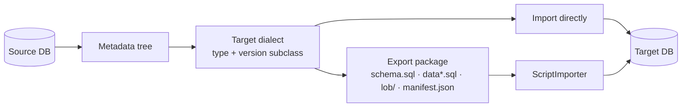

# SqlJam: Move Tables Across Databases with Schema, Data and All

> Tables, indexes, constraints, sequences, partitions and rows, in one go.

## 1. Overview

**SqlJam**: *Move tables across databases. Schema, data and all.*

A Java 17 + JavaFX desktop tool that copies tables between **MySQL, PostgreSQL, Oracle, SQL Server, H2, SQLite** and more, in any direction:
**import directly** into a target database, or save a self-describing **SQL export package** and import it later.


## 2. What Problem Does It Solve?

The hard part of a cross-database migration is not `INSERT`, it is the details: type names, identity columns, default value syntax, `bigint unsigned` overflow, timestamps shifted by time zones, BLOBs inflating scripts, and old servers rejecting new syntax. Hand-written scripts are slow and miss things.

SqlJam reads **one metadata tree** and generates SQL with a **dialect chosen by target type and version**. Export packages carry a `manifest.json`, so an import knows the target, checks completeness and verifies every file.

| Pain | SqlJam |
|---|---|
| Dialect differences | Types, identifiers, defaults, identity and literals translated by the dialect of each target |
| Old versions | Version subclasses: `Oracle11gDialect`, `PostgreSQL9Dialect`, `MySQL56Dialect`, `SQLServer2008Dialect` … |
| Missing keys & indexes | Primary keys, unique/regular indexes, foreign keys, comments, sequences, partitions |
| Huge scripts | Data files split at 10 MB: `orders.sql`, `orders_2.sql` … |
| LOBs | Stored as files, restored by primary key |
| Scripts without context | `manifest.json`: source, target, options, SHA-256 per file, row counts |

## 3. Quick Start

```bash
git clone git@github.com:paganini2008/sqljam.git && cd sqljam
./mvnw -DskipTests package       # Windows: mvnw.cmd, output goes to bin/
bin/sqljam.sh                    # Windows: bin\sqljam.bat, or double click the jar of your platform
```

```text
bin/
├── sqljam-1.0.0-SNAPSHOT-win.jar           # runnable jar of each platform,
├── sqljam-1.0.0-SNAPSHOT-mac-aarch64.jar   # JavaFX and all JDBC drivers inside
├── sqljam-1.0.0-SNAPSHOT-mac.jar
├── sqljam-1.0.0-SNAPSHOT-linux.jar
├── sqljam.sh / sqljam.bat                  # launchers, pick the jar of the platform
├── sqljam.properties                       # configuration, edit and restart
├── sqljam.vmoptions                        # JVM options, one per line
└── sqljam.png                              # Dock icon of macOS
```

`sqljam.properties` and `sqljam.vmoptions` sit next to the runnable jar. Edit them and restart, no rebuild needed.

A splash screen shows the loading of the configuration, the data sources and the JDBC drivers:

<p align="center"></p>

| 1. Log in to a data source | 2. Export wizard | 3. Progress |
|---|---|---|
|  |  |  |

## 4. Requirements

Only **Java 17+** is needed to run SqlJam. JavaFX and the JDBC drivers are inside the runnable jar, and building needs no Maven installation thanks to the Maven Wrapper (`./mvnw`).

| Platform | Runnable jar | Launcher | Supported |
|---|---|---|:---:|
| Windows 10 / 11 (x64) | `sqljam-<version>-win.jar` | `sqljam.bat` | ✅ |
| macOS Apple Silicon | `sqljam-<version>-mac-aarch64.jar` | `sqljam.sh` | ✅ |
| macOS Intel | `sqljam-<version>-mac.jar` | `sqljam.sh` | ✅ |
| Linux x64 (GTK 3) | `sqljam-<version>-linux.jar` | `sqljam.sh` | ✅ |

| Database | Version |
|---|---|
| MySQL | 5.5 to 9.x |
| PostgreSQL | 9.x to 16 |
| Oracle | 11g to 23ai |
| SQL Server | 2008 to 2022 |
| H2 / SQLite | 2.x / 3.x |

All JDBC drivers are bundled in the fat jar.

## 5. How It Works




- **Read metadata once**: `XxxMetaDataOperations` completes comments, identity, generated columns, partitions and sequences per database.
- **Generate for the target**: `DbType.createDialect(major, minor)` picks the version subclass.
- **Stream rows**: count rows (percentage progress) → page by primary key → normalize values → batch insert or SQL literals.

## 6. Code Examples

### Example 1: Export as a PostgreSQL package

**Input**: MySQL database `shop`

```java
ScriptExporter exporter = new ScriptExporter(new File("export"), DataFileStrategy.FILE_PER_TABLE, 10 * 1024 * 1024);
Exporter.ExportConfiguration config = exporter.getConfiguration();
config.setDbType(DbType.MYSQL);
config.setUrl(DbType.MYSQL.getUrl("localhost", 3306, "shop"));
config.setUsername("root");
config.setPassword("secret");
config.setIdReused(true);
exporter.setTargetDbType(DbType.POSTGRESQL);
exporter.exportDdlAndData();
```

**Output**

```text
export/
├── schema.sql   ├── data/orders.sql   ├── data/orders_2.sql
├── lob/         ├── lob-manifest.json ├── constraints.sql
└── manifest.json
```

### Example 2: Oracle → SQL Server directly (schema created)

```java
ImportExporter importer = new ImportExporter();
Exporter.ExportConfiguration source = importer.getExportConfiguration();
source.setDbType(DbType.ORACLE);
source.setUrl(DbType.ORACLE.getUrl("ora-host", 1521, "ORCL"));
source.setUsername("hr");
source.setPassword("secret");
source.setIncludedSchemaNames(new String[]{"HR"});
ImportExportHandler.ImportConfiguration target = importer.getImportConfiguration();
target.setDbType(DbType.SQLSERVER);
target.setUrl(DbType.SQLSERVER.getUrl("mssql-host", 1433, "demo"));
target.setUsername("sa");
target.setPassword("secret");
target.setTargetSchemaName("hr");
importer.exportDdlAndData();
```

**Output**: tables, keys, indexes, foreign keys, comments and sequences in `demo.hr`. Identities continue from the imported max value.

| Source column | → PostgreSQL | → Oracle | → SQL Server |
|---|---|---|---|
| MySQL `bigint unsigned` | `numeric(20, 0)` | `NUMBER(20,0)` | `decimal(20,0)` |
| PostgreSQL `jsonb` | same | `CLOB` | `nvarchar(max)` |
| SQL Server `datetime2(7)` | `timestamp` | `TIMESTAMP(7)` | same |

## 7. Configuration

All settings live in `bin/sqljam.properties` next to the runnable jar. Settings changed in the UI are saved to `~/.sqljam/sqljam.properties` and win over the file.

| Property | Default | Description |
|---|---|---|
| `sqljam.export.max-file-size` | `10485760` | Max bytes of a data file |
| `sqljam.export.data-file-strategy` | `SINGLE_FILE` | Single file or one file per table |
| `sqljam.export.lob-separated` | `true` | Write LOBs as files |
| `sqljam.export.page-size` | `5000` | Rows per page, tuned by benchmark |
| `sqljam.export.lob-page-size` | `100` | Rows per page for tables with LOB columns |
| `sqljam.banner.mode` | `console` | Startup banner with the version: console, log or off |
| `sqljam.import.batch-size` | `1000` | INSERT statements per batch when importing a package |
| `sqljam.ui.theme` | `Primer Dark` | 7 themes |
| `sqljam.pool.maximum-size` | `10` | Connection pool size |

## 8. Performance


| Scenario (200,000 rows × 6 columns) | Time | Rows/s |
|---|---|---|
| H2 → Oracle 23ai | 2.1 s | 95.3k |
| H2 → export package (32 MB, 4 files) | 2.9 s | 69.4k |
| H2 → PostgreSQL 16 | 3.2 s | 62.4k |
| H2 → MySQL 9.6 | 3.3 s | 60.7k |
| H2 → SQL Server 2022 | 5.0 s | 40.1k |
| Export package → PostgreSQL | 4.5 s | 44.5k |

Environment: Apple M2 Max, 32 GB, JDK 17. MySQL/PostgreSQL local, Oracle/SQL Server in Docker. Default settings.

**Quality**: 303 tests (full cross-database import matrix, export package round trips, old-version SQL executed on real servers, UI and boundary tests), 91% line coverage.

## 9. Design Trade-offs

- **Table-level focus**: tables, keys, indexes, constraints, sequences, partitions and comments: the objects data migration depends on.
- **Rows paged by primary key**: stable, deterministic reads on every database.
- **Tables copied one by one**: predictable load on production servers.
- **Plain SQL in packages**: readable, editable and portable. Direct import uses batched inserts for speed.
- **Version-specific SQL**: older servers get the syntax they understand instead of a lowest common denominator.

## 10. Summary

1. Any-to-any copies. Every cross-database pair passes automated tests.
2. Dialects are chosen by **type + version**. Old versions are subclasses.
3. Tables, indexes, constraints, sequences, partitions and comments move together.
4. Export package = SQL + LOB files + `manifest.json`. Export and import are paired.
5. Data files split at 10 MB by default. LOBs stored separately.
6. Timestamps, unsigned numbers, bits, money, UUID and JSON survive the trip.
7. Pooled connections and batch inserts: 40k to 95k rows/s for direct imports.
8. A mainstream dark UI with 7 themes, percentage progress and cancel.
