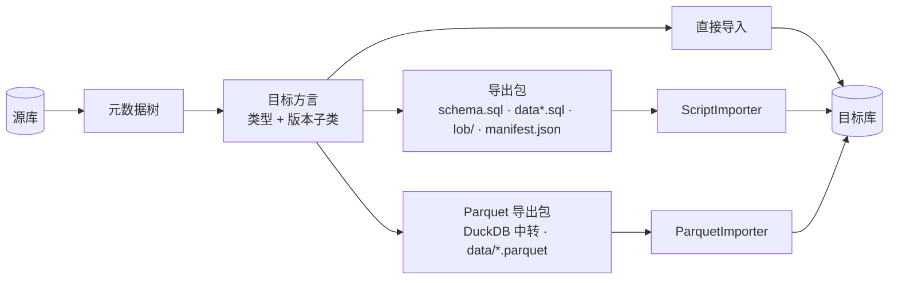

# SqlJam：跨数据库，一键搬表

> 结构、索引、约束、序列、分区、数据，一起搬走。

## 1. Overview

**SqlJam**：*Move tables across databases. Schema, data and all.*

一个 Java 17 + JavaFX 的桌面导入导出工具，支持关系型与 OLAP 数据库（**MySQL、MariaDB、PostgreSQL、Oracle、SQL Server、H2、SQLite、DuckDB、ClickHouse** 等）任意互导：
可以**直接导入目标库**，也可以在同一个 schema 里复制表，或者导出为带描述文件的 **SQL / Parquet 导出包**，之后再成对导入。


## 2. 解决什么问题？

跨库迁移最麻烦的不是 `INSERT`，而是那些"细节"：类型名不同、自增实现不同、默认值语法不同、`bigint unsigned` 溢出、时间被时区平移、BLOB 写进脚本后几百 MB、老版本数据库不认新语法……手写脚本既慢又容易漏。

SqlJam 用**一棵元数据树 + 按目标库和版本选择的方言**，把这些差异集中处理掉。导出包自带 `manifest.json`，导入时能校验"导给谁、完整不完整、文件有没有被改过"。

| 痛点 | SqlJam 的做法 |
|---|---|
| 方言差异 | 按目标方言统一翻译类型 / 标识符 / 默认值 / 自增 / 字面量 |
| 老版本 | `Oracle11gDialect`、`PostgreSQL9Dialect`、`MySQL56Dialect`、`SQLServer2008Dialect` 等版本子类 |
| 丢键丢索引 | 主键、唯一/普通索引、外键、注释、序列、分区一起迁移 |
| 脚本太大 | 数据文件按 10 MB 切分：`orders.sql`、`orders_2.sql`… |
| LOB 难处理 | LOB 单独存文件，按主键回填 |
| 脚本没有上下文 | `manifest.json`：源、目标、选项、文件 SHA-256、行数 |
| 分析要 Parquet | 内置 DuckDB 生成 Parquet 导出包，也能把其他工具产出的 Parquet 文件加载进任意表 |
| 数仓和业务库割裂 | DuckDB、ClickHouse 作为 OLAP 数据源，和关系型数据库分组展示 |
| 只要表的一部分 | 数据页查询（列、WHERE、GROUP BY、ORDER BY），只导出查询结果的行 |
| 原地复制一份表 | 同一 schema 内按 `{table}_copy` 复制，键、索引、约束自动改名，原表受保护 |
| 自定义和新型类型 | PostgreSQL 枚举与域、向量、联合、Map、Tuple、Variant |

## 3. Quick Start

```bash
git clone git@github.com:paganini2008/sqljam.git && cd sqljam
./mvnw -DskipTests package       # Windows 用 mvnw.cmd，输出到 bin/
bin/sqljam.sh                    # Windows 用 bin\sqljam.bat，也可以直接双击本平台的 jar
```

```text
bin/
├── sqljam-1.0.0-SNAPSHOT-win.jar           # 每个平台一个可运行 jar，
├── sqljam-1.0.0-SNAPSHOT-mac-aarch64.jar   # 内置 JavaFX 和全部 JDBC 驱动
├── sqljam-1.0.0-SNAPSHOT-mac.jar
├── sqljam-1.0.0-SNAPSHOT-linux.jar
├── sqljam.sh / sqljam.bat                  # 启动脚本，自动选择本平台的 jar
├── sqljam.properties                       # 外置配置，改完重启即可
├── sqljam.vmoptions                        # JVM 参数，一行一个
├── sqljam.png                              # macOS 程序坞图标
└── sqljam-tutorial.mp4                     # 教学视频，3 分钟内看完导出与导入
```

`sqljam.properties`、`sqljam.vmoptions` 和可运行 jar 放在一起。整个目录拷到任何地方都能用，双击启动也能找到配置。

启动时显示启动画面，同时加载配置、数据源和 JDBC 驱动：

<p align="center"></p>

首次启动会自带一个 **Example Shop (H2)** 示例数据源，包含几张电商表（categories、customers、products、orders、order_items），装好就能直接体验。删掉了也没关系，登录页的 **Example** 按钮或菜单 **Help → Restore Example Database** 随时可以恢复。

右键数据源选 **Connect**，连上之后同一个菜单变成 **Disconnect**，断开时它的表页签一起关闭。导入导出选目标数据源时，旁边的 **+** 按钮可以当场新建一个。工具栏最右边是 **Exit**。**Help → About SqlJam** 里有版本、主页、仓库地址和作者联系方式，右下角的 GitHub 图标点一下直接打开仓库。

[教学视频](https://github.com/paganini2008/sqljam/blob/master/docs/assets/sqljam-tutorial.mp4)以示例库演示一遍：筛选行、导出到文件、导出包导入 PostgreSQL，再直接复制到 SQL Server 和 Oracle。

| 1. 登录数据源 | 2. 导出向导 | 3. 进度 |
|---|---|---|
|  |  |  |

| 4. 数据查询 | 5. 导出包浏览 | 6. Parquet 文件 |
|---|---|---|
|  |  |  |

## 4. Requirements

运行只需要 **Java 17+**。JavaFX 和 JDBC 驱动都打进了可运行 jar，从源码构建也不需要安装 Maven，项目自带 Maven Wrapper（`./mvnw`）。

| 平台 | 可运行 jar | 启动方式 | 支持 |
|---|---|---|:---:|
| Windows 10 / 11（x64） | `sqljam-<版本>-win.jar` | `sqljam.bat` | ✅ |
| macOS Apple Silicon | `sqljam-<版本>-mac-aarch64.jar` | `sqljam.sh` | ✅ |
| macOS Intel | `sqljam-<版本>-mac.jar` | `sqljam.sh` | ✅ |
| Linux x64（GTK 3） | `sqljam-<版本>-linux.jar` | `sqljam.sh` | ✅ |

| 数据库 | 版本 |
|---|---|
| MySQL | 5.5 ~ 9.x |
| PostgreSQL | 9.x ~ 16 |
| Oracle | 11g ~ 23ai |
| SQL Server | 2008 ~ 2022 |
| MariaDB | 10.3 ~ 11.x |
| H2 / SQLite | 2.x / 3.x |
| DuckDB（OLAP） | 1.x |
| ClickHouse（OLAP） | 24.x ~ 26.x |

JDBC 驱动全部打进 fat jar，无需额外下载。

## 5. How It Works




- **读一次元数据**：`XxxMetaDataOperations` 按库补全注释、自增、生成列、分区、序列。
- **按目标生成 SQL**：`DbType.createDialect(major, minor)` 选出版本子类。
- **数据流**：先统计行数（百分比进度）→ 按主键分页读取 → 值归一化 → 批量写入或生成字面量。
- **Parquet**：数据经过内置的 DuckDB 中转，`COPY ... TO 'x.parquet'` 写出，`read_parquet` 读回。

## 6. Code Examples

### Example 1：导出为 PostgreSQL 脚本包

**Input**：MySQL 库 `shop`

```java
ScriptExporter exporter = new ScriptExporter(new File("export"), DataFileStrategy.FILE_PER_TABLE, 10 * 1024 * 1024);
Exporter.ExportConfiguration config = exporter.getConfiguration();
config.setDbType(DbType.MYSQL);
config.setUrl(DbType.MYSQL.getUrl("localhost", 3306, "shop"));
config.setUsername("root");
config.setPassword("secret");
config.setIdReused(true);
exporter.setTargetDbType(DbType.POSTGRESQL);
exporter.exportDdlAndData();
```

**Output**：

```text
export/
├── schema.sql   ├── data/orders.sql   ├── data/orders_2.sql
├── lob/         ├── lob-manifest.json ├── constraints.sql
└── manifest.json
```

同样的表导出为 Parquet：

```java
ParquetExporter parquet = new ParquetExporter(new File("export-parquet"));
parquet.setTargetDbType(DbType.POSTGRESQL);
parquet.setCompression("ZSTD");
parquet.exportDdlAndData();   // schema.sql、data/orders.parquet、constraints.sql、manifest.json
```

### Example 2：Oracle 直接导入 SQL Server（自动建 schema）

```java
ImportExporter importer = new ImportExporter();
Exporter.ExportConfiguration source = importer.getExportConfiguration();
source.setDbType(DbType.ORACLE);
source.setUrl(DbType.ORACLE.getUrl("ora-host", 1521, "ORCL"));
source.setUsername("hr");
source.setPassword("secret");
source.setIncludedSchemaNames(new String[]{"HR"});
ImportExportHandler.ImportConfiguration target = importer.getImportConfiguration();
target.setDbType(DbType.SQLSERVER);
target.setUrl(DbType.SQLSERVER.getUrl("mssql-host", 1433, "demo"));
target.setUsername("sa");
target.setPassword("secret");
target.setTargetSchemaName("hr");
importer.exportDdlAndData();
```

**Output**：表、主键、索引、外键、注释、序列都在 `demo.hr`，自增从导入的最大值继续。

按查询导出部分行，或者在同一 schema 里复制：

```java
source.getTableQueries().put("EMPLOYEES", new TableQuery(List.of("EMPLOYEE_ID", "NAME", "SALARY"),
        "SALARY > 1000", null, "SALARY DESC"));   // 目标表按这几列自动创建
target.setTableNamePattern("{table}_copy");       // 在 EMPLOYEES 旁边生成 EMPLOYEES_COPY
```

| 源列 | → PostgreSQL | → Oracle | → SQL Server |
|---|---|---|---|
| MySQL `bigint unsigned` | `numeric(20, 0)` | `NUMBER(20,0)` | `decimal(20,0)` |
| PostgreSQL `jsonb` | same | `CLOB` | `nvarchar(max)` |
| SQL Server `datetime2(7)` | `timestamp` | `TIMESTAMP(7)` | same |
| PostgreSQL 枚举 / 域 | same（在目标 schema 创建） | `VARCHAR2` / 基础类型 | `varchar` / 基础类型 |
| MySQL / Oracle `VECTOR` | `text` | same | `nvarchar(max)` |
| ClickHouse `Array(T)` / `Map(K, V)` | `text` | `CLOB` | `nvarchar(max)` |

## 7. Configuration

全部配置在可运行 jar 旁边的 `bin/sqljam.properties` 里。界面里修改的设置保存在 `~/.sqljam/sqljam.properties`，优先于该文件。

| Property | Default | Description |
|---|---|---|
| `sqljam.export.max-file-size` | `10485760` | 单个数据文件上限（字节） |
| `sqljam.export.data-file-strategy` | `SINGLE_FILE` | 单文件 / 每表一个文件 |
| `sqljam.export.lob-separated` | `true` | LOB 单独存文件 |
| `sqljam.export.page-size` | `5000` | 每页读取行数（实测最优） |
| `sqljam.export.lob-page-size` | `100` | 含 LOB 的表每页行数，内存更省 |
| `sqljam.banner.mode` | `console` | 启动 banner（带版本号）：console / log / off |
| `sqljam.import.batch-size` | `1000` | 导入导出包时每批 INSERT 条数 |
| `sqljam.ui.theme` | `Primer Dark` | 主题，可切换 7 种 |
| `sqljam.pool.maximum-size` | `10` | 连接池大小 |

## 8. Performance


| 场景（20 万行 × 6 列） | 耗时 | 行/秒 |
|---|---|---|
| H2 → Oracle 23ai | 2.1 s | 95.3k |
| H2 → 导出包（32 MB，切成 4 个文件） | 2.9 s | 69.4k |
| H2 → PostgreSQL 16 | 3.2 s | 62.4k |
| H2 → MySQL 9.6 | 3.3 s | 60.7k |
| H2 → SQL Server 2022 | 5.0 s | 40.1k |
| 导出包 → PostgreSQL | 4.5 s | 44.5k |

环境：Apple M2 Max / 32 GB / JDK 17。MySQL、PostgreSQL 本机，Oracle、SQL Server 在 Docker。默认配置。

**质量**：578 个测试（含覆盖每种数据库全部字段类型的跨库互导矩阵、导出包与 Parquet 回放、同 schema 复制、旧版本语法在真实库上执行、界面功能与边界测试），行覆盖率 91%。

## 9. 设计取舍（Design Trade-offs）

- **聚焦表级对象**：表、主键、索引、约束、序列、分区、注释，数据迁移真正依赖的对象。
- **按主键分页读取**：在每种数据库上都稳定、可重复。
- **逐表复制**：对生产库的压力可预期。
- **导出包是纯 SQL**：可读、可改、可移植。直接导入走批量写入，追求速度。
- **按版本生成 SQL**：老版本数据库拿到的是它能理解的语法，而不是最低公分母。
- **Parquet 交给 DuckDB**：一个内置引擎负责读写 Parquet，不引入 Hadoop 依赖。
- **分组结果用于浏览**：导出的始终是表的真实行，GROUP BY 的结果是这些行的视图。
- **复制要有新表名**：同一 schema 内复制需要 `{table}_copy` 这样的表名，原表永远不会被覆盖。

## 10. Summary

1. 任意数据库之间互导，所有跨库组合均通过自动化测试。
2. 方言按**类型 + 版本**选择，老版本差异用子类表达。
3. 表、索引、约束、序列、分区、注释一起迁移。
4. 导出包 = SQL + LOB 文件 + `manifest.json`，导出导入成对。
5. 数据文件默认 10 MB 切分，LOB 单独存放。
6. 时间、无符号、bit、money、UUID、JSON 等值跨库不失真。
7. 连接池 + 批量写入，直接导入 4 万 ~ 9.5 万行/秒。
8. 暗色主流界面，7 种主题，百分比进度与取消。
9. Parquet 导出包与外部 Parquet 文件加载，DuckDB、ClickHouse 作为 OLAP 数据源。
10. 表数据可查询，只导出查询结果，也能在同一 schema 内复制表。
